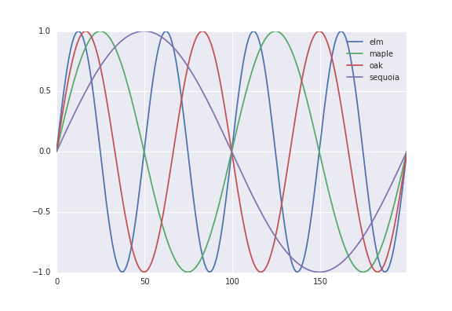

===========================================
Aggregating datasets with Views and Bundles
===========================================
Just as Treants and Trees have the :class:`~datreant.data.limbs.Data` limb 
for storing and retrieving datasets in their filesystem trees, the
:class:`~datreant.core.View` and :class:`~datreant.core.Bundle` objects also
have the :class:`~datreant.data.agglimbs.AggData` limb for accessing these
datasets in aggregate.

Given a directory with four Treants ::

    > ls
    elm/  maple/  oak/  sequoia/

we'll gather these up in a Bundle ::

    >>> import datreant.core as dtr
    >>> import glob
    >>> b = dtr.Bundle(glob.glob('*'))
    >>> b
    <Bundle([<Treant: 'sequoia'>, <Treant: 'maple'>, <Treant: 'oak'>, <Treant: 'elm'>])>

and then attach the :class:`~datreant.data.limbs.AggData` limb to only this
Bundle instance with::

    >>> import datreant.data
    >>> b.attach('data')

.. note:: Attaching a limb like :class:`~datreant.data.agglimbs.AggData` to a
          Bundle or View with the :meth:`~datreant.core.Bundle.attach` method
          will attach the required limb to each member instance. In this case,
          each member gets a :class:`~datreant.data.limbs.Data` limb.

and so we can now do::

    >>> b.data
    <AggData([])>

This tells us that there are no datasets with the same key within every member
of the Bundle. So, let's make something that does. Let's build a "dataset" that
gives us a sinusoid based on a characteristic of each Treant in the Bundle::

    >>> import numpy as np
    >>> b.categories['frequency'] = [1, 2, 3, 4]
    >>> for member in b:
    ...     member.data['sinusoid/array'] = np.sin(
    ...         member.categories['frequency'] * np.linspace(0, 8*np.pi,
    ...                                                      num=200))

So now if we do::

    >>> b.data
    <AggData(['sinusoid/array'])>

we see we now have a dataset name in common among all members. If we recall
it ::

    >>> sines = b.data['sinusoid/array']
    >>> type(sines)
    dict

we get back a dictionary with the full path to each member as keys::

    >>> sines.keys()
    ['/home/bob/research/arborea/sequoia/',
     '/home/bob/research/arborea/oak/',
     '/home/bob/research/arborea/elm/',
     '/home/bob/research/arborea/maple/']

and the values are the :`numpy` arrays we stored for each member. If we'd
rather get back a dictionary with names instead of paths, we could do that
with the :meth:`~datreant.data.agglimbs.AggData.retrieve` method::

    >>> b.data.retrieve('sinusoid/array', by='name').keys()
    ['sequoia', 'oak', 'maple', 'elm']

Getting uuids as the keys is also possible, and is often useful since these
will be unique among Treants, while names (and in some cases, paths) are
generally not.

Aggregating datasets not represented among all members
======================================================
We can still aggregate over datasets even if their keys are not present among
all members. We can see what keys are available among at least one member in
the Bundle with::

    >>> b.data.any
    ['a grocery list',
    'a/better/grocery/list',
    'shopping lists/clothes',
    'shopping lists/food',
    'shopping lists/misc',
    'sinusoid/array',
    'something enormous',
    'something wicked']

and we see the datasets we stored using the single Treant earlier. If we
recall one of these, we get an aggregation ::

    >>> b.data['shopping lists/clothes']
    {'/home/bob/research/arborea/sequoia/': ['shirts', 'pants', 'shoes']}

with only the datasets present for that key. Since it's only the one Treant
that has a dataset with this name, we get a dictionary with one key-value pair.

MultiIndex aggregation for ``pandas`` objects
=============================================
:mod:`numpy` arrays or pickled datasets are always retrieved in aggregate as
dictionaries, since this is the simplest way of aggregating these objects while
retaining the ability to identify datasets from individual members. Aggregation
is most useful, however, for :mod:`pandas` objects, since for these we can
naturally build versions of the same data structure with an additional index
for data membership.

We'll make a :class:`pandas.Series` version of the same dataset we stored
before::

    >>> import pandas as pd
    >>> for member in b:
    ...     member.data['sinusoid/series'] = pd.Series(member.data['sinusoid/array'])

So now when we retrieve this aggregated dataset by name, we get a series with
an outermost index of member names::

    >>> sines = b.data.retrieve('sinusoid/series', by='name')
    >>> sines.groupby(level=0).head()
    sequoia  0    0.000000
             1    0.125960
             2    0.249913
             3    0.369885
             4    0.483966
    oak      0    0.000000
             1    0.369885
             2    0.687304
             3    0.907232
             4    0.998474
    maple    0    0.000000
             1    0.249913
             2    0.483966
             3    0.687304
             4    0.847024
    elm      0    0.000000
             1    0.483966
             2    0.847024
             3    0.998474
             4    0.900479
    dtype: float64

So we can immediately use this for aggregated analysis, or perhaps just pretty
plots::

    >>> for name, group in sines.groupby(level=0):
    ...     group.reset_index(level=0, drop=True).plot(legend=True, label=name) 

Subselection with Views
=======================
Just as we can :ref:`subselect datasets with Trees <Trees_subselections>`, we
can use :class:`~datreant.core.View` objects to work with subselections in
aggregate. Using our Bundle from above, we can construct a View::

    >>> sinusoids = dtr.View(b).trees['sinusoid']
    >>> sinusoids
    <View([<Tree: 'sequoia/sinusoid/'>, <Tree: 'maple/sinusoid/'>, <Tree: 'oak/sinusoid/'>, <Tree: 'elm/sinusoid/'>])>

And just like a :class:`~datreant.core.Tree` can access datasets with the
:class:`~datreant.data.limbs.Data` limb in the same way a
:class:`~datreant.core.Treant` can, a :class:`~datreant.core.View` can access
datasets in aggregate in the same way as a :class:`~datreant.core.Bundle`::
    
    >>> sinusoids.attach('data')
    >>> sinusoids.data
    <AggData(['array', 'series'])>

These are the datasets common to all the Trees in this View. We can retrieve
an aggregation as before::

    >>> sinusoids.data['series'].groupby(level=0).head()
    /home/bob/research/arborea/sequoia/sinusoid/  0    0.000000
                                                  1    0.031569
                                                  2    0.063106
                                                  3    0.094580
                                                  4    0.125960
    /home/bob/research/arborea/maple/sinusoid/    0    0.000000
                                                  1    0.063106
                                                  2    0.125960
                                                  3    0.188312
                                                  4    0.249913
    /home/bob/research/arborea/oak/sinusoid/      0    0.000000
                                                  1    0.094580
                                                  2    0.188312
                                                  3    0.280355
                                                  4    0.369885
    /home/bob/research/arborea/elm/sinusoid/      0    0.000000
                                                  1    0.125960
                                                  2    0.249913
                                                  3    0.369885
                                                  4    0.483966
    dtype: float64

.. note:: For aggregations from a View, it is not possible to aggregate by
          uuid because Trees do not have them. Also, in many cases, as here,
          aggregating by name will not give unique keys. When the aggregation
          keys are not unique, a :exc:`KeyError` is raised.

API reference: AggData
======================
See the :ref:`AggData_api` API reference for more details.
